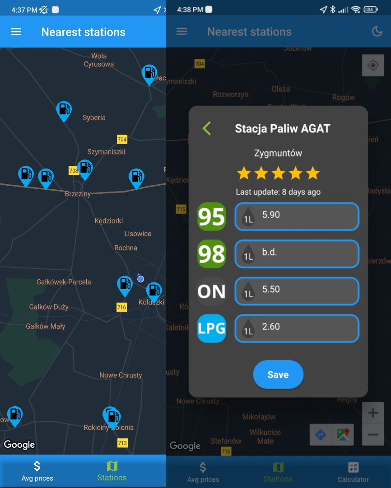
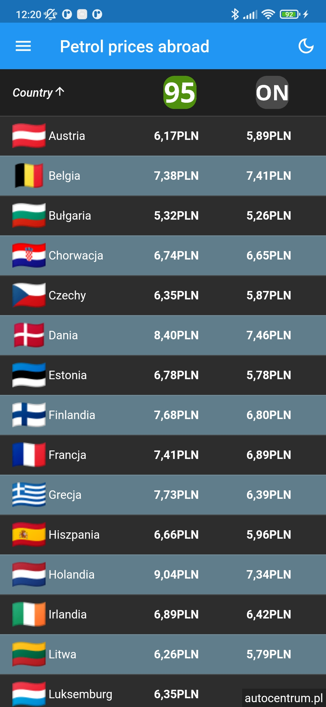
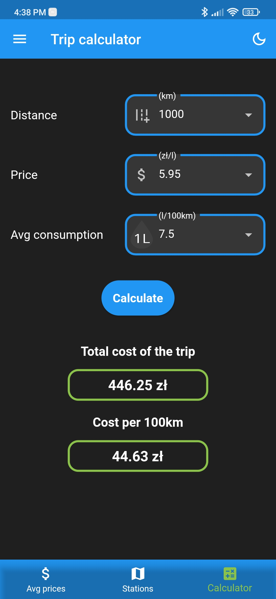
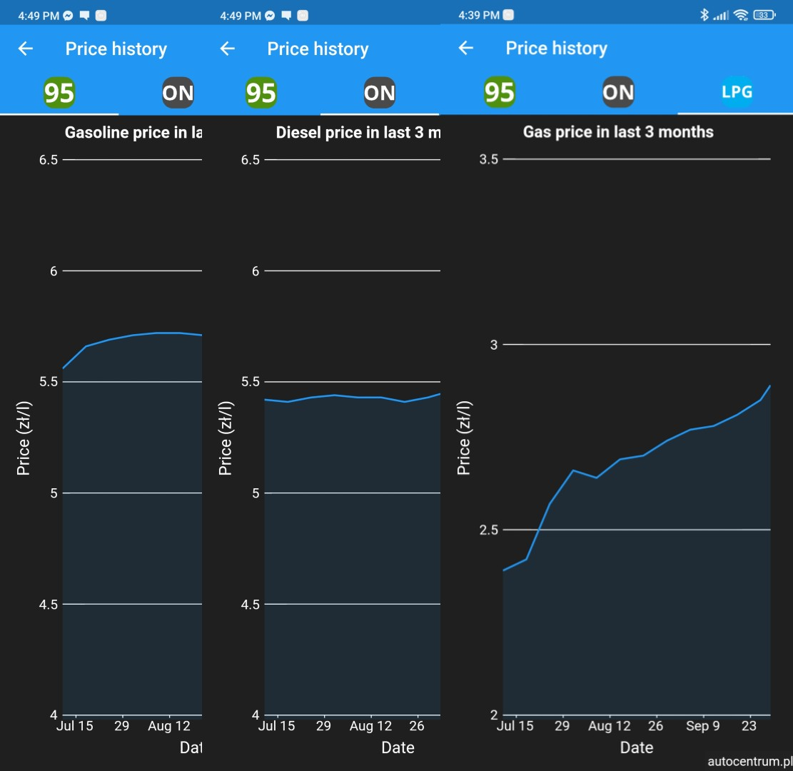
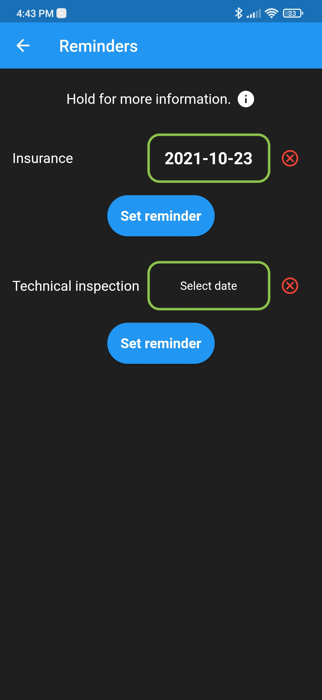
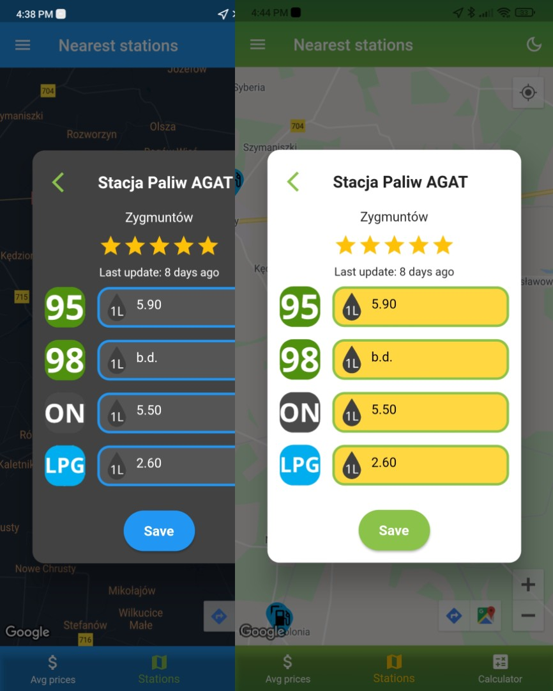

# Fuel tracker

`Flutter` `Dart` `Firebase Authentication` `Cloud Firestore` `Google Maps API`

Fuel tracker is a mobile app that allows users to track fuel prices and share actual price at the station they are.

# Functionallities

## Finding nearby petrol stations

- map shows all petrol stations 30km around user location from Google Maps API
- after clicking at marker user can see petrol prices at that station
- user can share actual petrol prices at selected station

## Avarage petrol prices in selected countries

App allows you to check avarage petrol prices (PB95, ON) in selected countries in Europe.

## Travel cost calculator

Basic calculator that allows user to calculate total cost of the route based on given price of petrol and avarage fuel consumption of his car.

## Historical charts

Charts that show avarage price of PB95, ON and LPG in last 3 months in Poland based on https://www.autocentrum.pl/paliwa/ceny-paliw/

## Notifications

User can set reminder for insurance and technical inspection of his car. Notification will pop-up 5 days before given date.

## Light and dark mode

Application has two color styles - light and dark.

- checking avarage petrol prices (PB95, PB98, ON, ON+, LPG) in regions across Poland
